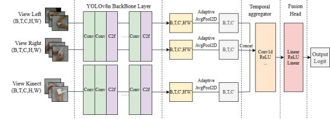
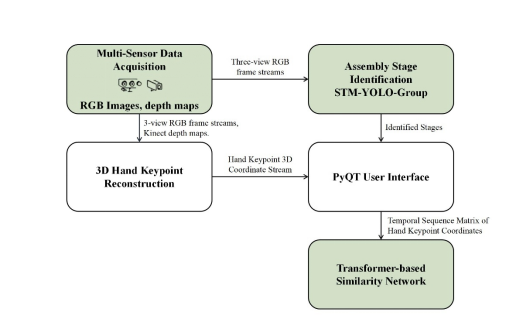

# 🎯 Real-Time Spatiotemporal Assembly Verification System

> Multi-View Assembly Monitoring | STM-YOLO Ensemble | Transformer-Based Motion Similarity | PyQt GUI Interface

A lightweight and deployable framework for procedural verification in manual assembly, combining multi-camera spatiotemporal detection with 3D motion similarity assessment.  
🧪 Built with PyTorch + ONNX + MediaPipe + PyQt5.

---

## 🚀 Overview

This project implements a real-time vision-based system to verify human assembly actions across multiple stages. It leverages:

- **STM-YOLO Group**: A spatiotemporal YOLO-based ensemble that segments assembly procedures into discrete transitions using multi-view RGB streams.
  
- **Transformer-based Siamese Network**: Evaluates 3D hand motion similarity between live operator actions and golden-standard reference sequences.
- **3D Keypoint Reconstruction**: Integrates MediaPipe and Kinect depth data to recover 3D hand trajectories.
- **PyQt GUI Interface**: Provides real-time feedback, error display, and procedural guidance.

---

## 🖼️ System Architecture


---

## 🧠 Key Features

| Module | Description |
|--------|-------------|
| `STM-YOLO` | Converts YOLOv8 backbone to a temporal classifier using 1D Conv over multi-view embeddings |
| `Siamese Transformer` | Evaluates motion similarity using shared-weight Transformers over 3D hand trajectories |
| `MediaPipe + Kinect` | Combines stereo RGB and depth for precise hand tracking |
| `GUI (PyQt5)` | Real-time display of current stage, errors, and guidance |
| `ONNX Runtime` | Real-time inference >10 FPS on A6000 GPU or deployable via NCNN |

---

## 📦 Installation

```bash
git clone https://github.com/YHYQ0123/ME5001_Hand_tracking_and_objection_detetction.git
cd ME5001_Hand_tracking_and_objection_detetction
pip install -r requirements.txt
```

**Dependencies**:
- Python
- numpy, opencv-python
- PyQt5
- MediaPipe
- torch / torchvision
- ultralytics
- pykinect2
- opencv-python
- torchvision

---

## 🧪 Datasets

### 1. Multi-View Assembly Dataset (MVA)

- 3 camera views: Kinect + 2 Logitech webcams
- 5 procedural stages (e.g., grasp, align, fasten)
- 15 sequences/stage × 3 operators = 225 labeled clips

### 2. FPHA Dataset (for motion similarity)

- 1,331 sequences, 45 action classes
- 21 hand joints × 3D → 63D vector/frame
- Used for Siamese model training & evaluation

---

## 📊 Model Performance

### STM-YOLO Stage Classifier

| Metric | YOLOv8n-cls | STM-YOLO |
|--------|-------------|----------|
| Accuracy | 66.98% | **86.98%** |
| F1 Score | 47.16% | **78.2%** |
| Precision | 47.15% | 85.5% |
| Recall | 51.96% | 79.3% |

### Transformer Similarity (on FPHA filtered)

| Metric | Value |
|--------|-------|
| Accuracy | 91.12% |
| F1 Score | **0.9166** |
| Precision | 0.8647 |
| Recall | 0.9750 |

---

## 🧰 How to Run


1. **Train STM-YOLO**:
```bash
python "Programs, Apps, Codes Folder\STM_YOLO\stm_yolo\train.py"
```

1. **Train Similarity Model**:
```bash

python "Programs, Apps, Codes Folder\Transformer-based_Similarity_model\train.py"
```

---


## 🧑‍🔬 Citation

If you use this project or dataset, please cite:

```bibtex
@article{yeqing2024stm,
  title={Spatiotemporal Perception and Motion Similarity Learning for Real-Time Assembly Verification},
  author={Ye Qing and Niu Yuqian and ONG Soh Khim and NEE Yeh Ching, Andrew},
  year={2024}
}
```

---

## 🙋 Author

Ye Qing (叶青)  
M.Sc. in Mechanical Engineering @ NUS  
📧 e1373546@u.nus.edu  
🌐 [GitHub](https://github.com/YHYQ0123)

---

## 📌 Acknowledgements

This research is supervised by  
**Prof. ONG Soh Khim** and **Prof. NEE Yeh Ching, Andrew**  
National University of Singapore  
Supported by CSC Innovation Talent Program
